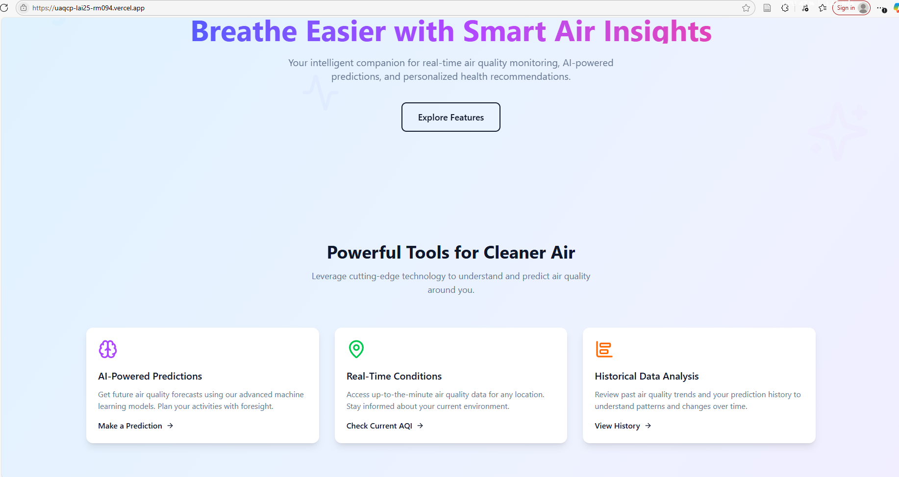
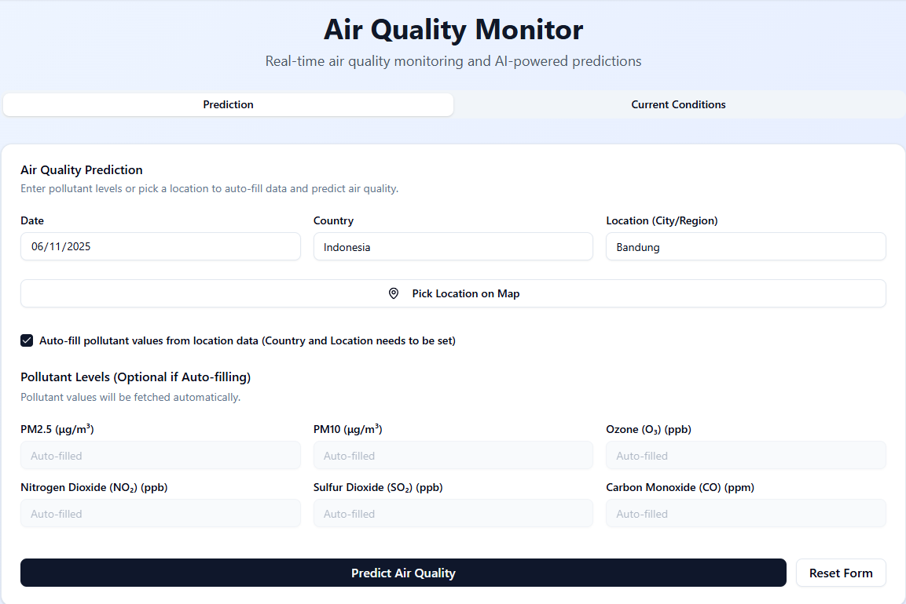
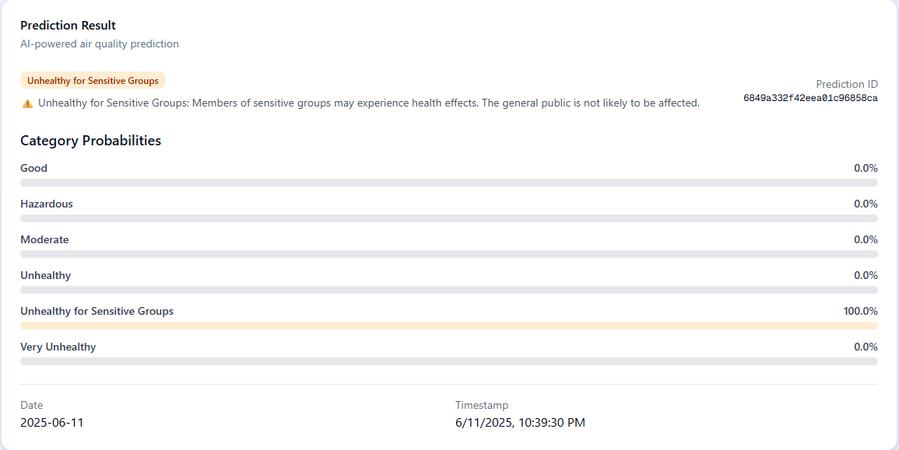
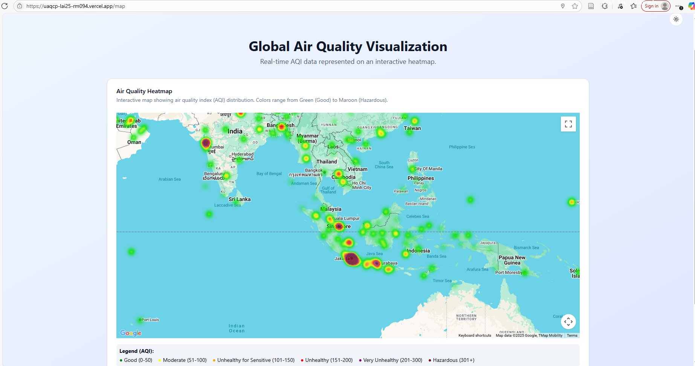

# Sistem Prediksi Kualitas Udara Perkotaan

## Deskripsi

Proyek ini mengembangkan sistem prediksi kualitas udara berbasis machine learning (XGBoost) yang dapat memprediksi indeks kualitas udara (Air Quality Index/AQI) secara harian berdasarkan data historis polutan. Selain itu, sistem ini menyediakan visualisasi interaktif data polusi secara real-time melalui Google Maps API, sehingga pengguna dapat memantau dan menganalisis kualitas udara dengan mudah.

## Anggota Tim

- A002YBF021 – Agung Kurniawan – Institut Teknologi Bandung
- A135YAM326 – Muhammad Husain – Politeknik Negeri Ujung Pandang
- A009YBF463 – Sintario Satya – Universitas Gunadarma
- A135XAF486 – Tsamarah Muthi'ah Abdullah – Politeknik Negeri Ujung Pandang

## Struktur Proyek

```
/ML_training        # Training & preprocessing model ML
/client            # Dashboard Next.js (frontend visualisasi)
/server            # FastAPI server untuk prediksi API
/.github           # Konfigurasi GitHub dan workflow
/.vscode           # Konfigurasi editor
README.md          # Dokumentasi utama
CONTRIBUTING.md    # Panduan kontribusi
```

## Fitur Utama

- **Prediksi AI:** Prediksi kualitas udara masa depan menggunakan model machine learning (XGBoost).
- **Kondisi Real-Time:** Melihat data AQI terkini berdasarkan lokasi.
- **Visualisasi Global:** Peta sebaran kualitas udara berbasis Google Maps API.
- **Dashboard Modern:** Antarmuka Next.js untuk analisis dan interaksi.
- **API Prediksi:** Backend FastAPI untuk serving model prediksi.
- **Alur Data & Training:** Workflow preprocessing dan training model siap pakai.

## Setup & Instalasi

### 1. Clone Repository

```bash
git clone https://github.com/srios000/urban-air-quality-prediction.git
cd urban-air-quality-prediction
```

### 2. Training Model (ML_training)

```bash
# Buat environment Conda
conda create -n main python=3.12
conda activate main

# Masuk folder ML_training dan install dependencies
pip install -r ML_training/requirements.txt

# Jalankan training script untuk generate model
python ML_training/main.py
# Hasil: file .pkl model akan disimpan di server/infrastructure/ml/models_store
```

### 3. Setup API Prediksi (server)

```bash
# Masuk folder server dan install dependencies
pip install -r server/requirements.txt

# Jalankan FastAPI server
python server/main.py

# NB: memerlukan google API key untuk seluruh fitur dapat berjalan
```

### 4. Setup Dashboard (client)

```bash
cd client/
yarn install   # atau npm install
yarn dev       # atau npm start
```

### Cloud Deployment

Aplikasi juga tersedia pada cloud:  
🌐 https://uaqcp-lai25-rm094.vercel.app/

## Preview Aplikasi

### Beranda & Fitur



### Form Prediksi



### Hasil Prediksi



### Visualisasi Global



## Sumber Data

- [aqicn.org Historical Data](https://aqicn.org/historical/)

## Detail Model

- **Algoritma:** XGBoost
- **Best Parameters:**
  - subsample: 1.0
  - n_estimators: 200
  - max_depth: 7
  - learning_rate: 0.2
  - colsample_bytree: 0.8
- **Cross-validation:**
  - Akurasi: 0.9968 ± 0.0003
  - F1 Macro: 0.9352 ± 0.0077
  - Precision Macro: 0.9423 ± 0.0091
  - Recall Macro: 0.9295 ± 0.0068

## Kontributor

- [agungknwn](https://github.com/agungknwn)
- [srios000](https://github.com/srios000)
- [MuthiahAinun](https://github.com/MuthiahAinun)

## Lisensi

Belum didistribusikan lisensi khusus. Hubungi kontributor untuk penggunaan dan kolaborasi.
